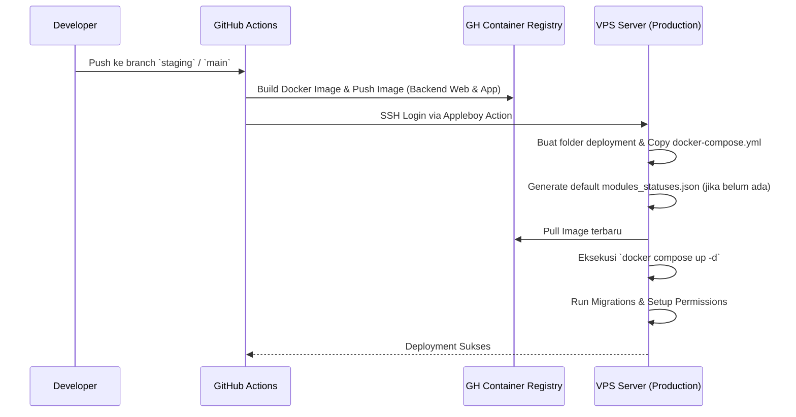
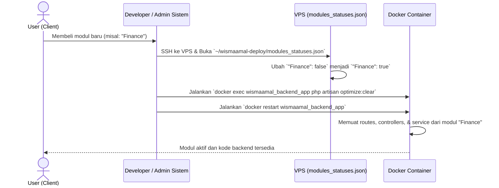
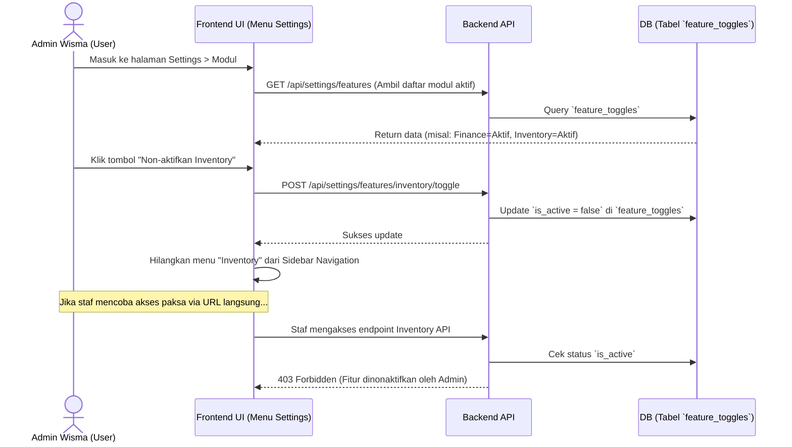

# Arsitektur Deployment & Manajemen Modul Wisma Amal

Dokumen ini menjelaskan alur *deployment* sistem (CI/CD), mekanisme aktivasi modul saat pengguna membeli lisensi baru (oleh Developer), dan cara pengguna (*User*) mengatur fitur modul secara mandiri melalui *Frontend*.

---

## 1. Alur Deployment (CI/CD)
Sistem Wisma Amal Gorontalo menggunakan arsitektur *containerized* (Docker) dan *Modular Monolith*. Proses *deployment* diotomatisasi menggunakan GitHub Actions.

### Diagram Deployment


---

## 2. Alur Pembelian & Aktivasi Modul (Level Developer)
Sistem menggunakan `nwidart/laravel-modules` di mana `modules_statuses.json` bertindak sebagai *gatekeeper* utama. File ini menentukan modul mana saja yang kode sumbernya akan dimuat (*loaded*) ke dalam memori aplikasi Laravel.

### Kapan ini digunakan?
Saat pengguna (*tenant*/institusi) baru saja membeli modul tambahan. File ini diatur langsung oleh **Developer** (atau skrip otomatisasi *billing* di level infrastruktur).

### Diagram Aktivasi Modul


### Langkah Teknis Aktivasi di VPS:
1. **Edit File Konfigurasi:** Buka dan ubah status modul di `~/wismaamal-deploy/modules_statuses.json` menjadi `true`.
2. **Bersihkan Cache Laravel:** Agar framework tidak menggunakan cache lama yang menganggap modul belum aktif.
   ```bash
   docker exec wismaamal_backend_app php artisan optimize:clear
   ```
3. **Restart Container:** Agar aplikasi me-*load* ulang kerangka kerja dengan modul yang baru.
   ```bash
   docker restart wismaamal_backend_app
   ```

*(Catatan: Karena file json di-mount via volume di docker-compose, kita tidak perlu mem-build ulang image Docker).*

---

## 3. Alur Pengaturan Modul oleh User (Level Frontend / Soft-Toggle)
Setelah sebuah modul diaktifkan di level server, fitur dari modul tersebut sudah terintegrasi ke dalam sistem. Namun, pengguna (Admin) diberi kebebasan untuk **menyalakan/mematikan** (*soft-toggle*) fitur tersebut sesuai kebutuhan mereka.

Hal ini diatur melalui tabel `feature_toggles` di dalam database.

### Kapan ini digunakan?
Saat Admin institusi ingin menyembunyikan menu tertentu agar tidak membingungkan stafnya, meskipun secara lisensi mereka sudah membelinya.

### Diagram Manajemen Fitur oleh User


### Kesimpulan Pemisahan Peran:
1. **Level Kerangka Kerja (`modules_statuses.json`):** Berfungsi sebagai Hard-Toggle. Dikelola oleh pembuat sistem (Developer). Berdampak pada efisiensi memori karena modul yang dimatikan tidak akan membebani aplikasi (tidak me-load RAM).
2. **Level Aplikasi Database (`feature_toggles`):** Berfungsi sebagai Soft-Toggle. Dikelola oleh pengelola sistem (Admin Wisma). Berdampak pada UI/UX, di mana kode tetap berjalan di memori Laravel namun akses dari user dicegat oleh sistem otorisasi (Middleware).
