# ERD Global Terpusat (PlantUML) — Terverifikasi

Kode PlantUML di bawah ini **100% sudah diverifikasi langsung** dari skema *database* nyata di *backend* menggunakan `Schema::getTables()` dan `Schema::getColumns()`. Setiap tabel dan setiap kolom sudah dicocokkan.

Salin kode di bawah ini ke **[PlantUML Web Editor](https://www.plantuml.com/plantuml/uml/SyfFKj2rKt3CoKnELR1Io4ZDoSa70000)** untuk mendapatkan gambar PNG/SVG.

```plantuml
@startuml Global ERD - Wisma Amal Gorontalo
skinparam linetype ortho
skinparam nodesep 60
skinparam ranksep 60
skinparam packageStyle rectangle
skinparam package {
    BackgroundColor White
}

' ============================================================
' MODUL: CORE & AUTH
' ============================================================
package "Core & Auth Module" #E0E0E0 {
    entity "users" as users {
        * id : bigint <<PK>>
        --
        name : varchar
        email : varchar
        password : varchar
        email_verified_at : timestamp
        remember_token : varchar
    }
    entity "user_profiles" as user_profiles {
        * id : bigint <<PK>>
        --
        user_id : bigint <<FK>>
        id_card_number : varchar
        phone_number : varchar
        gender : varchar
        job : varchar
        address_ktp : text
        emergency_contact_name : varchar
        emergency_contact_phone : varchar
        ktp_photo_path : varchar
    }
    entity "roles" as roles {
        * id : bigint <<PK>>
        --
        name : varchar
        description : varchar
        guard_name : varchar
    }
    entity "permissions" as permissions {
        * id : bigint <<PK>>
        --
        name : varchar
        guard_name : varchar
        target : varchar
        description : text
    }
    entity "model_has_roles" as model_has_roles {
        * role_id : bigint <<FK>>
        --
        model_type : varchar
        model_id : bigint
    }
    entity "model_has_permissions" as model_has_permissions {
        * permission_id : bigint <<FK>>
        --
        model_type : varchar
        model_id : bigint
    }
    entity "role_has_permissions" as role_has_permissions {
        * permission_id : bigint <<FK>>
        * role_id : bigint <<FK>>
    }
    entity "personal_access_tokens" as personal_access_tokens {
        * id : bigint <<PK>>
        --
        tokenable_type : varchar
        tokenable_id : bigint <<FK>>
        name : text
        token : varchar
        abilities : text
        last_used_at : timestamp
        expires_at : timestamp
    }
}

' ============================================================
' MODUL: ROOMS
' ============================================================
package "Rooms Module" #E8F5E9 {
    entity "rooms" as rooms {
        * id : bigint <<PK>>
        --
        number : varchar
        title : varchar
        price : varchar
        price_daily : varchar
        description : text
        facilities : json
        status : enum
        is_highlighted : tinyint
    }
    entity "room_images" as room_images {
        * id : bigint <<PK>>
        --
        room_id : bigint <<FK>>
        image_path : varchar
        thumbnail_path : varchar
        order : int
    }
}

' ============================================================
' MODUL: SCHEDULE (Booking Sewa)
' ============================================================
package "Schedule Module" #FFF3E0 {
    entity "room_schedules" as room_schedules {
        * id : bigint <<PK>>
        --
        room_id : bigint <<FK>>
        legacy_lease_id : bigint
        type : varchar
        status : varchar
        start_date : date
        end_date : date
        created_by : bigint
        tenant_user_id : bigint <<FK>>
        tenant_name : varchar
        tenant_id_number : varchar
        tenant_phone : varchar
        tenant_id_photo : varchar
        agreed_price : decimal
        payment_scheme : varchar
        dp_amount : decimal
        dp_paid_at : timestamp
        activated_at : timestamp
        finished_at : timestamp
    }
}

' ============================================================
' MODUL: FINANCE
' ============================================================
package "Finance Module" #FFF9C4 {
    entity "invoices" as invoices {
        * id : bigint <<PK>>
        --
        schedule_id : bigint <<FK>>
        lease_id : bigint
        type : varchar
        tenant_user_id : bigint <<FK>>
        tenant_name : varchar
        tenant_phone : varchar
        room_number : varchar
        period_start : date
        period_end : date
        invoice_number : varchar
        amount : decimal
        status : varchar
        due_date : date
        payment_expires_at : timestamp
    }
    entity "payments" as payments {
        * id : bigint <<PK>>
        --
        invoice_id : bigint <<FK>>
        payment_method : varchar
        midtrans_fee : int
        fee_bearer : varchar
        payment_proof_path : varchar
        transaction_id : varchar
        status : varchar
        snap_token : varchar
        payment_data : text
        admin_notes : text
    }
    entity "expenses" as expenses {
        * id : bigint <<PK>>
        --
        title : varchar
        description : text
        amount : decimal
        expense_date : date
        reference_id : bigint
        reference_type : varchar
    }
    entity "fixed_expense_entries" as fixed_expense_entries {
        * id : bigint <<PK>>
        --
        jenis : varchar
        bulan : tinyint
        tahun : smallint
        amount : decimal
        notes : text
        recorded_by : bigint
        is_filled : tinyint
    }
    entity "fines" as fines {
        * id : bigint <<PK>>
        --
        tenant_user_id : bigint <<FK>>
        schedule_id : bigint <<FK>>
        amount : decimal
        reason : text
        status : varchar
        waive_reason : text
        paid_at : timestamp
    }
    entity "fine_invoice" as fine_invoice {
        * id : bigint <<PK>>
        --
        fine_id : bigint <<FK>>
        invoice_id : bigint <<FK>>
    }
    entity "finance_active_tenants" as finance_active_tenants {
        * id : bigint <<PK>>
        --
        schedule_id : bigint <<FK>>
        user_id : bigint <<FK>>
        room_number : varchar
        tenant_name : varchar
        tenant_phone : varchar
        start_date : date
        end_date : date
    }
    entity "refund_requests" as refund_requests {
        * id : bigint <<PK>>
        --
        schedule_id : bigint <<FK>>
        payment_id : bigint <<FK>>
        bank_name : varchar
        account_number : varchar
        account_holder_name : varchar
        refund_amount : decimal
        admin_fee : decimal
        proof_path : varchar
        status : enum
        is_refund_eligible : tinyint
        admin_notes : text
        processed_at : timestamp
    }
}

' ============================================================
' MODUL: GUESTS
' ============================================================
package "Guests Module" #F3E5F5 {
    entity "guests" as guests {
        * id : bigint <<PK>>
        --
        lease_id : bigint
        user_id : bigint <<FK>>
        schedule_reference_id : bigint
        tenant_name : varchar
        tenant_email : varchar
        tenant_phone : varchar
        name : varchar
        check_in_at : datetime
        check_out_at : datetime
        stay_completed_notified_at : datetime
        relationship : varchar
        total_days : int
        billable_days : int
        charge_amount : decimal
    }
    entity "guest_bills" as guest_bills {
        * id : bigint <<PK>>
        --
        guest_id : bigint <<FK>>
        bill_number : varchar
        amount : decimal
        payment_method : varchar
        status : varchar
        payment_proof_path : varchar
        transaction_id : varchar
        snap_token : text
        admin_notes : text
        paid_at : timestamp
    }
    entity "guest_active_contexts" as guest_active_contexts {
        * id : bigint <<PK>>
        --
        user_id : bigint <<FK>>
        lease_id : bigint
        schedule_id : bigint <<FK>>
        room_id : bigint <<FK>>
        room_price : decimal
        tenant_name : varchar
        tenant_email : varchar
        tenant_phone : varchar
        is_active : tinyint
    }
}

' ============================================================
' MODUL: MAINTENANCE
' ============================================================
package "Maintenance Module" #FFEBEE {
    entity "maintenance_requests" as maintenance_requests {
        * id : bigint <<PK>>
        --
        resident_id : bigint <<FK>>
        reporter_user_id : bigint <<FK>>
        reporter_name : varchar
        reporter_phone : varchar
        room_id : bigint <<FK>>
        location : varchar
        title : varchar
        description : text
        status : enum
        reported_at : timestamp
    }
    entity "maintenance_request_images" as maintenance_request_images {
        * id : bigint <<PK>>
        --
        maintenance_request_id : bigint <<FK>>
        image_path : varchar
    }
    entity "maintenance_request_updates" as maintenance_request_updates {
        * id : bigint <<PK>>
        --
        maintenance_request_id : bigint <<FK>>
        user_id : bigint <<FK>>
        status : enum
        description : text
    }
    entity "maintenance_update_images" as maintenance_update_images {
        * id : bigint <<PK>>
        --
        maintenance_request_update_id : bigint <<FK>>
        image_path : varchar
    }
    entity "maintenance_schedules" as maintenance_schedules {
        * id : bigint <<PK>>
        --
        technician_name : varchar
        location : varchar
        type : enum
        subtype : enum
        status : enum
        notes : varchar
        start_time : datetime
        end_time : datetime
        created_by : bigint
    }
    entity "maintenance_schedule_updates" as maintenance_schedule_updates {
        * id : bigint <<PK>>
        --
        maintenance_schedule_id : bigint <<FK>>
        user_id : bigint <<FK>>
        status : varchar
        notes : text
    }
}

' ============================================================
' MODUL: INVENTORY
' ============================================================
package "Inventory Module" #E3F2FD {
    entity "inventories" as inventories {
        * id : bigint <<PK>>
        --
        name : varchar
        description : text
        quantity : int
        condition : varchar
        purchase_price : decimal
    }
}

' ============================================================
' MODUL: NOTIFICATION
' ============================================================
package "Notification Module" #FFFDE7 {
    entity "notification_logs" as notification_logs {
        * id : bigint <<PK>>
        --
        type : varchar
        target_phone : varchar
        message_body : text
        status : varchar
        error_response : text
        is_read : tinyint
    }
}

' ============================================================
' MODUL: SYSTEM & SETTINGS
' ============================================================
package "System & Settings Module" #F5F5F5 {
    entity "app_settings" as app_settings {
        * id : bigint <<PK>>
        --
        key : varchar
        value : text
        description : varchar
    }
    entity "bank_accounts" as bank_accounts {
        * id : bigint <<PK>>
        --
        bank_name : varchar
        account_number : varchar
        account_holder : varchar
        payment_instructions : text
        is_active : tinyint
        sort_order : int
    }
    entity "feature_toggles" as feature_toggles {
        * id : bigint <<PK>>
        --
        parent_id : bigint <<FK>>
        key : varchar
        name : varchar
        description : text
        icon : varchar
        is_active : tinyint
        is_locked : tinyint
        sort_order : int
    }
    entity "feature_toggle_logs" as feature_toggle_logs {
        * id : bigint <<PK>>
        --
        toggle_id : bigint <<FK>>
        user_id : bigint <<FK>>
        old_value : tinyint
        new_value : tinyint
    }
}

' ============================================================
' RELASI ANTAR TABEL
' ============================================================
' Core
users ||--o{ user_profiles
users ||--o{ model_has_roles
users ||--o{ model_has_permissions
roles ||--o{ model_has_roles
permissions ||--o{ role_has_permissions
roles ||--o{ role_has_permissions
permissions ||--o{ model_has_permissions
users ||--o{ personal_access_tokens

' Rooms
rooms ||--o{ room_images
rooms ||--o{ room_schedules

' Schedule
users ||--o{ room_schedules : tenant
room_schedules ||--o{ invoices
room_schedules ||--|| finance_active_tenants
room_schedules ||--o{ refund_requests
room_schedules ||--o{ guests
room_schedules ||--o{ guest_active_contexts

' Finance
invoices ||--o{ payments
payments ||--o{ refund_requests
fines ||--o{ fine_invoice
invoices ||--o{ fine_invoice
users ||--o{ fines

' Guests
users ||--o{ guests
guests ||--o{ guest_bills
rooms ||--o{ guest_active_contexts

' Maintenance
users ||--o{ maintenance_requests : reporter
rooms ||--o{ maintenance_requests : lokasi
maintenance_requests ||--o{ maintenance_request_images
maintenance_requests ||--o{ maintenance_request_updates
maintenance_request_updates ||--o{ maintenance_update_images
maintenance_schedules ||--o{ maintenance_schedule_updates

' Settings
feature_toggles ||--o{ feature_toggles : sub-fitur
feature_toggles ||--o{ feature_toggle_logs
users ||--o{ feature_toggle_logs

@enduml
```

---
> **Catatan Verifikasi:** Tabel-tabel sistem Laravel internal (`cache`, `cache_locks`, `failed_jobs`, `job_batches`, `jobs`, `migrations`, `password_reset_tokens`, `sessions`) **sengaja tidak dimasukkan** karena bukan bagian dari desain domain bisnis aplikasi.
