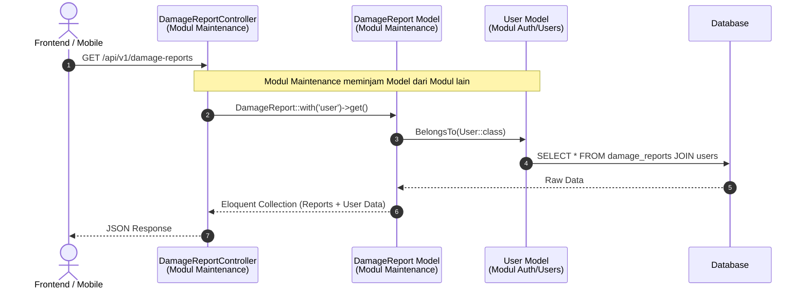
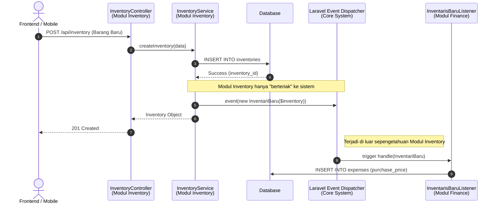

# Komunikasi Antar Modul (Modular Monolith)

Dalam arsitektur *Modular Monolith* (khususnya menggunakan *package* `nwidart/laravel-modules` seperti pada *backend* Wisma Amal Gorontalo), ada aturan ketat agar setiap modul tetap independen (tidak saling mengunci/*tightly coupled*).

Berdasarkan struktur kode Anda, terdapat **2 pola komunikasi utama** antar modul:

## 1. Komunikasi Sinkron / *Synchronous* (Untuk GET Data)
Saat sebuah modul hanya perlu **membaca data (GET)** dari modul lain, komunikasi dilakukan secara langsung melalui *Eloquent Relationships*, *Repository*, atau pemanggilan *Model* antar *namespace*.

**Contoh Kasus:** Modul `Maintenance` ingin menampilkan detail `DamageReport` beserta nama pelapornya (yang berada di modul `Auth` atau kelak `Users`).

**Kenapa boleh langsung?** 
Membaca data (*Read*) tidak mengubah stat (*State*) aplikasi, sehingga aman memanggil *Model/Repository* dari modul lain secara langsung. Ini membuat *query* sangat efisien (bisa memanfaatkan `JOIN` atau *Eager Loading* di level database).

---

## 2. Komunikasi Berbasis Event / *Event-Driven* (Untuk ADD/UPDATE/DELETE Data)
Saat sebuah modul **menambah atau mengubah data (Write)** dan perubahan tersebut memiliki efek samping ke modul lain, komunikasi **TIDAK BOLEH** dilakukan secara langsung (memanggil *Controller/Service* modul lain). Hal ini agar jika modul tujuan dimatikan, modul asal tidak mengalami *error* atau *crash*.
Solusinya adalah menggunakan **Laravel Events & Listeners**.

**Contoh Kasus:** *Admin* menambah `Inventory` baru yang memiliki `purchase_price` di modul `Inventory`. Modul `Finance` (Keuangan) perlu mencatat itu sebagai pengeluaran (*Expense*).

**Kelebihan Pendekatan Ini (*Loose Coupling*):**
1. **Tidak Bergantung:** Modul `Inventory` sama sekali tidak perlu mengimpor `FinanceService` atau tahu menahu soal tabel `expenses`.
2. **Aman Dimatikan:** Jika modul `Finance` dinonaktifkan (di `modules_statuses.json`), API Tambah Inventaris akan **tetap berjalan normal** (status 201). Modul `Inventory` hanya menyebarkan *event*, jika tidak ada modul `Finance` yang "mendengar", sistem akan mengabaikannya dengan aman (sudah teruji di *Unit Test*).

---

## Kesimpulan Aturan Emas (Golden Rule)
Di *backend* Anda, tim pengembang menerapkan aturan:
- **Butuh Baca Data Tetangga?** $\rightarrow$ *Direct Call* (Gunakan Model/Relasi `belongsTo`).
- **Butuh Mengubah/Menambah Data Tetangga?** $\rightarrow$ *Event-Driven* (Buat *Event* di modul sumber, buat *Listener* di modul target).
