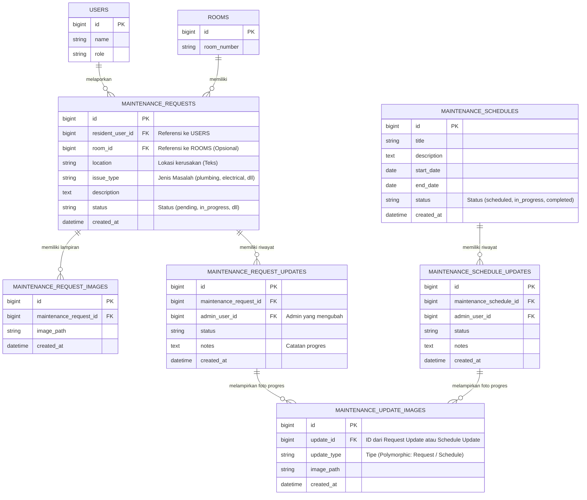
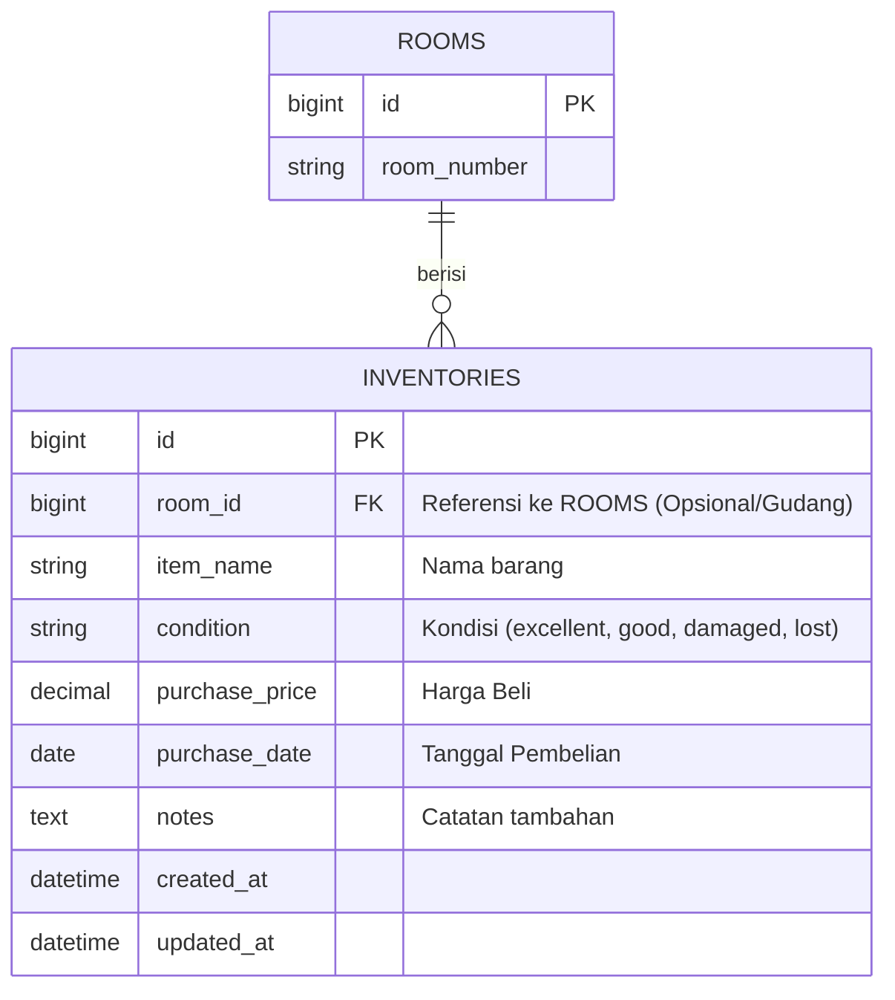

# Entity Relationship Diagram (ERD) - Fase 3

Dokumen ini berisi visualisasi struktur tabel database (ERD) untuk modul **Pemeliharaan (Maintenance)** dan modul **Inventaris (Inventory)** pada sistem Wisma Amal Gorontalo. 

Diagram ini di-generate menggunakan format standar *Mermaid.js* sehingga mudah disisipkan di berbagai alat dokumentasi (seperti GitHub, Notion, atau aplikasi Markdown lainnya) dan *screenshot*-nya bisa langsung Anda lampirkan di skripsi.

---

## 3.1 ERD Modul Pemeliharaan (Maintenance)

Modul Pemeliharaan memiliki struktur data yang cukup kompleks karena memisahkan antara Laporan Kerusakan (dari penyewa) dan Jadwal Pemeliharaan (dari pengelola), namun keduanya bisa memiliki riwayat perkembangan/progres (*updates*) dan lampiran bukti foto (*images*).

### Penjelasan Relasi:
1. Setiap **Laporan Kerusakan (`maintenance_requests`)** terikat ke seorang **Penghuni (`users`)** dan dapat terikat pada sebuah **Kamar (`rooms`)**. 
2. Sebuah laporan kerusakan dapat memiliki **banyak lampiran foto (`maintenance_request_images`)** sebagai bukti saat melapor.
3. Saat laporan dikerjakan, admin menambahkan **riwayat progres (`maintenance_request_updates`)**, yang juga dapat dilampirkan **foto hasil perbaikan (`maintenance_update_images`)**.
4. Logika yang sama berlaku untuk **Jadwal Pemeliharaan (`maintenance_schedules`)**, di mana setiap perawatan memiliki catatan histori pembaruan beserta bukti foto selesainya.

---

## 3.2 ERD Modul Inventaris (Inventory)

Modul Inventaris dibuat sangat *independent* (berdiri sendiri) dan *loose coupling* agar dapat berfungsi meskipun modul Keuangan (Finance) tidak ada. Referensi ruangannya juga bersifat opsional jika barang diletakkan di area luar kamar.

### Penjelasan Relasi:
1. Tabel **Inventaris (`inventories`)** dapat dihubungkan ke **Kamar (`rooms`)** melalui relasi *One-to-Many* (Satu kamar bisa berisi banyak inventaris).
2. Jika *field* `room_id` bernilai `null`, ini berarti barang inventaris tersebut sedang berada di gudang pusat, fasilitas umum (lobi/dapur), atau merupakan aset lepas yang belum ditugaskan ke sebuah kamar.
3. Meskipun terdapat *field* `purchase_price`, secara ERD tabel ini **tidak berelasi langsung (FK)** dengan tabel pengeluaran (Finance) untuk menjaga kemurnian pemisahan *Modular Monolith*. Integrasi dengan data keuangan sepenuhnya dilakukan dengan cara saling melempar *Event Listener* di level sistem.
