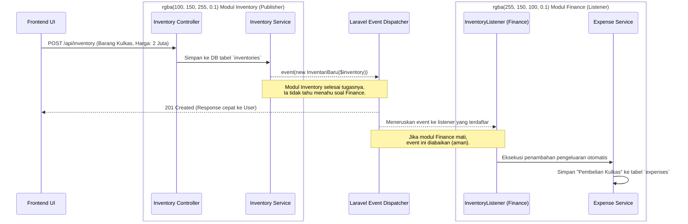
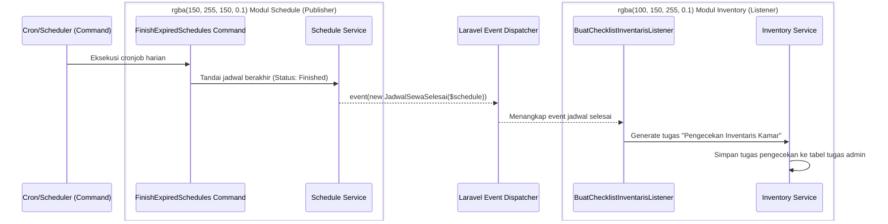

# Desain Teknis & Aliran Data Antar Modul (Modular Monolith)

Dokumen ini menjelaskan rancangan arsitektur untuk modul **Pemeliharaan (Maintenance)** dan **Inventaris (Inventory)**, serta bagaimana modul-modul ini saling berkomunikasi di dalam ekosistem sistem *Modular Monolith* Wisma Amal Gorontalo menggunakan arsitektur berbasis *Event-Driven*.

---

## 2.1 Desain Modul Pemeliharaan (Maintenance) & Inventaris

### A. Modul Pemeliharaan (Maintenance)
Modul Pemeliharaan dirancang untuk menangani dua jenis alur kerja yang berbeda namun saling berkaitan:
1. **Laporan Kerusakan (Damage Report):** Bersifat insidental/reaktif. Laporan dikirimkan oleh *Resident* (penghuni kamar) atau pengelola ketika menemukan kerusakan aset. Data yang disimpan mencakup detail kerusakan, foto bukti, lokasi, dan status perbaikan (Pending, In Progress, Resolved).
2. **Jadwal Pemeliharaan (Maintenance Schedule):** Bersifat preventif/proaktif. Dikelola oleh *Admin* atau *Super-Admin* untuk melakukan perawatan aset secara berkala (misalnya servis AC setiap 6 bulan).

**Struktur Tabel Utama (ERD Konseptual):**
- `maintenance_requests` (Laporan Kerusakan)
  - `id` (PK)
  - `resident_user_id` (FK ke Users)
  - `room_id` (FK ke Rooms - Opsional jika kerusakan di area umum)
  - `location` (Teks lokasi kerusakan)
  - `issue_type` (Enum: plumbing, electrical, dll)
  - `description`
  - `status` (pending, in_progress, resolved, rejected)
- `maintenance_schedules` (Jadwal Pemeliharaan)
  - `id` (PK)
  - `title` & `description`
  - `scheduled_date` (Tanggal pelaksanaan)
  - `status` (scheduled, in_progress, completed, cancelled)
- `maintenance_updates` (Riwayat Progres)
  - `id` (PK)
  - `maintenance_request_id` / `maintenance_schedule_id` (Polymorphic FK)
  - `notes` (Catatan progres harian/tindakan yang dilakukan)

### B. Modul Inventaris (Inventory)
Modul ini berfungsi untuk mencatat, melacak, dan mengelola kondisi aset fisik yang dimiliki oleh Wisma Amal (baik yang ada di dalam kamar penyewa maupun di fasilitas umum).
Setiap barang memiliki rekam jejak kondisi dan harga beli.

**Struktur Tabel Utama (ERD Konseptual):**
- `inventories`
  - `id` (PK)
  - `item_name` (Nama Barang, misal: Lemari Jati)
  - `room_id` (FK ke Rooms - null jika diletakkan di gudang/area umum)
  - `condition` (Enum: excellent, good, damaged, lost)
  - `purchase_price` (Harga beli barang)
  - `purchase_date` (Tanggal beli)

---

## 2.2 Implementasi Aliran Data Antar Modul (Event-Driven Architecture)

Dalam sistem *Modular Monolith*, kita **tidak boleh** membiarkan modul saling memanggil tabel database satu sama lain secara langsung (*tight coupling*). Jika Modul Inventaris memanggil *query* ke Modul Finance secara langsung, maka sistem akan gagal beroperasi (`Hard-Error`) apabila lisensi Modul Finance sedang dinonaktifkan oleh *Developer*.

Sebagai solusinya, aliran data antar modul diimplementasikan menggunakan **Event-Driven Architecture (Event & Listener)** bawaan Laravel. 

### Prinsip Kerja Aliran Data (Event-Driven)
Setiap kali ada perubahan data penting di sebuah modul, modul tersebut hanya akan berteriak (Melempar *Event*) ke sistem inti (*Event Dispatcher*). Modul tersebut tidak peduli siapa yang mendengarnya. Jika ada modul lain yang aktif dan berkepentingan, modul tersebut akan menangkap (Me-*Listen*) dan memproses datanya.

### Contoh Kasus 1: Pembelian Inventaris Baru Memengaruhi Keuangan (Finance)
Ketika Admin mendaftarkan Inventaris baru yang memiliki harga beli (`purchase_price`), data tersebut harus masuk ke pembukuan pengeluaran (*Expense*).

**Diagram Aliran Data (Inventory -> Finance):**

### Contoh Kasus 2: Jadwal Sewa Berakhir Memengaruhi Pemeriksaan Inventaris
Ketika jadwal sewa penghuni berakhir, sistem harus meminta Admin untuk melakukan *Checklist* Inventaris kamar tersebut.

**Diagram Aliran Data (Schedule -> Inventory):**

### Keunggulan Arsitektur Ini:
1. **Loose Coupling (Tidak Saling Ketergantungan):** Jika Modul Finance di-*disable* (dimatikan), Modul Inventory tetap bisa menambahkan barang tanpa error (karena ia hanya melempar event, dan tidak akan ada yang memproses event tersebut jika Finance mati). Hal ini dibuktikan dengan berjalannya test `InventoryService dapat digunakan tanpa Finance module aktif` dengan status *PASS*.
2. **Kinerja UI Lebih Cepat (Asynchronous Potential):** Lemparan *event* bisa disetel ke *Queue* (antrean background), sehingga respons API ke klien (aplikasi *mobile/web*) menjadi sangat cepat tanpa harus menunggu Modul Finance selesai mencatat pembukuan. 
3. **Mudah Dikembangkan (Scalable):** Di masa depan, jika ada Modul "Notifikasi SMS/WhatsApp" yang juga ingin dikirimkan saat ada inventaris baru, kita cukup membuat satu *Listener* baru di modul notifikasi tanpa perlu membongkar/menyentuh kode *Modul Inventory* sama sekali.
